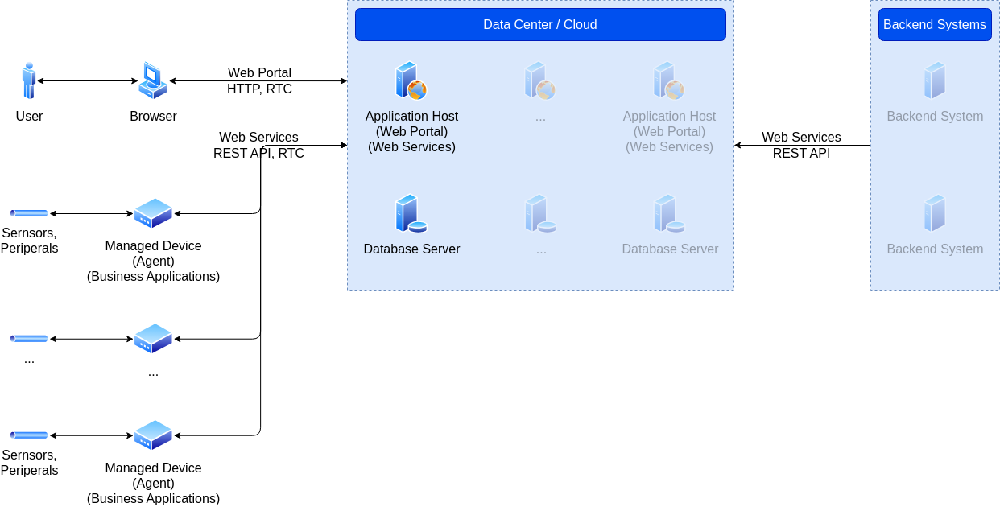

# Device Management Framework

Device Management Framework is an open-source framework for managing Edge AI & IoT devices.

## Services

The framework provides the following services:

- Device Identity: The service uses fingerprinting services (host name, NIC MAC address, SSH public key) to identify the device using backend database and store the device identity locally.
- Device Monitoring: The service captures basic device metrics (CPU, memory, last reboot time) into a backend database.
- Device Configuration: The service allows for centralized device configuration and application deployment.

## Repository

The repository contains the following components:

- Framework
- Reference Solutions
  - Garden Management System: Provides an end-to-end reference implementation of the framework and its features. The system collects current weather conditions (temperature, humidity, pressure & light) data from device sensors and displays the information on a web site.
  - Peripherals: Provides reference implementations for using various hardware components such as sensors, LEDs, motors, switches, etc.

## Components

Solution consists of the following components:

- Devices.Service: Provides framework services to be deployed to cloud infrastructure.
- Devices.Service.Solutions: Provides reference solution services to be deployed to cloud infrastructure.
- Devices.Web: Provides framework web UI components.
- Devices.Web.Solutions: Provides reference solution web UI components.
- Devices.Host: Provides hosting environment for Devices.Service, Devices.Service.Solutions, Devices.Web and Devices.Web.Solutions components.
- Devices.Client: Provides framework device client.
- Devices.Client.Solutions: Provides reference solution device client.

## References

- [Development Environment](Resources/Documents/Development.md)
- [AWS Host Configuration](Resources/Documents/AWS.md)
- [Device Operations](Resources/Documents/Operations.md)
- [Reference Solutions](Resources/Documents/Solutions.md)
- [Platforms](Resources/Documents/Platforms.md)
- [Release History](Resources/Documents/Releases.md#release-history)
- [Roadmap](Resources/Documents/Roadmap.md#capability-roadmap)
- [FAQ](Resources/Documents/FAQ.md)